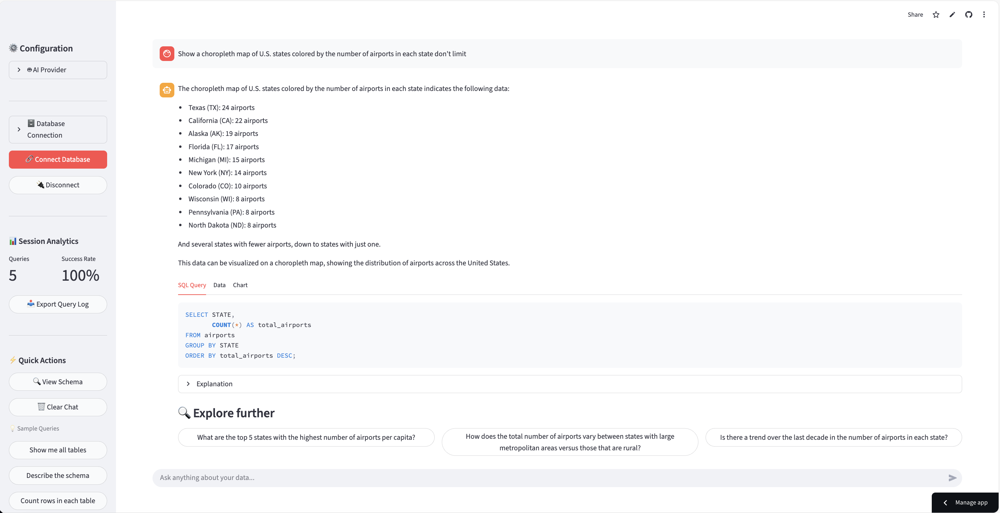
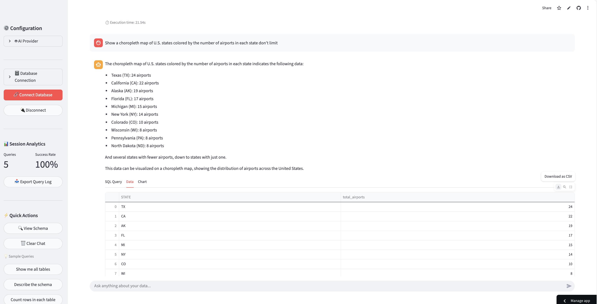
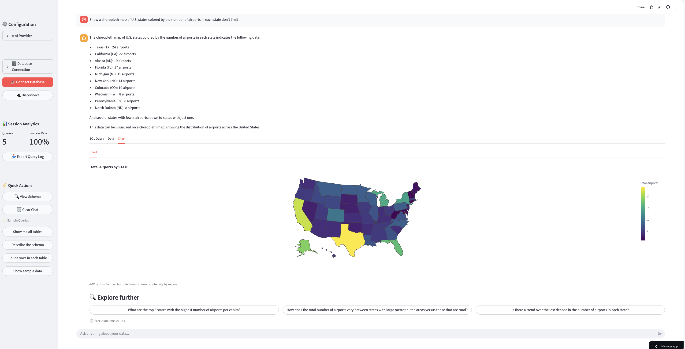

# ⚡ LyteQuery AI Powered SQL Agent

> **Your database speaks English now.**

Stop writing SQL. Start asking questions. LyteQuery turns natural language into database insights in seconds.<br>
**Ask → Query → Insight**.  <br>
One question is all it takes. LyteQuery writes the SQL, fetches the results, and turns them into charts you can use immediately. <br>
Perfect for people who prefer insights over syntax battles.

[](https://lytequery.streamlit.app/) [](LICENSE)

## Demo
[](https://lytequery.streamlit.app/)
[](https://lytequery.streamlit.app/)
[](https://lytequery.streamlit.app/)

## 🚨 The Problem

Data teams are bottlenecked. Analysts waste time on syntax. Executives wait days for simple answers. <br>
**The solution?** Make databases conversational.

## ✨ Features

- **Flexible Model Providers**  
  Choose from your favorite LLMs: <br>
  
  
  
  


- **Multiple Database Options**  
   
   
  

- **Natural-Language to Insights**  
  Ask questions in plain English get SQL, results, and visual insights automatically.

- **Context-Aware Conversations**  
  LyteQuery remembers previous questions for smooth follow-ups like  
  *“Only show last quarter”* no context lost.

- **SQL Transparency**  
  View and understand the generated SQL with optional explanations so you stay fully in control.
 
**Zero SQL knowledge required.**  
LyteQuery handles joins, aggregations, and query optimizations. You just ask!

## ⚙️ Setup & Installation

### 1. Clone the Repository
```bash
git clone <REPO_URL>
cd LyteQuery
```
### 2. Create & Activate Virtual Environment
- Windows:
  ```
  python -m venv venv
  .\venv\Scripts\activate
  ```
- Mac:
  ```
  python3 -m venv venv
  source venv/bin/activate
  ```
### 3. Install Dependencies

```
pip install -r requirements.txt
```

## 🚀 Usage

#### 1. Running the Web Application
To start the interactive web interface, run the following command:
```
streamlit run app.py
```
Your web browser should open to the application's URL (usually http://localhost:8501).

#### 2. Ask Questions
**Example:**
> “Show the top 10 products by revenue.” LyteQuery → Builds SQL → Executes query → Renders bar chart.

### 📝 License
This project is licensed under the **MIT License**. See the [LICENSE](LICENSE) file for more details.

Contributions welcome built with ❤️ to make querying & insights feel effortless.
